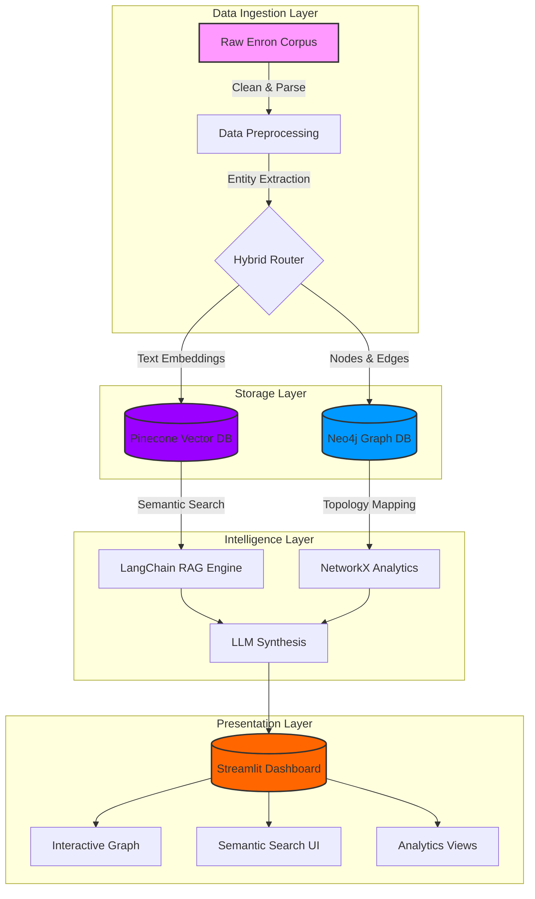

  
  # 🏢 AI KNOWLEDGE GRAPH BUILDER
  
  ### *Enterprise Intelligence Platform*
  
  [](https://python.org)
  [](https://streamlit.io)
  [](https://neo4j.com)
  [](https://pinecone.io)
  [](https://langchain.com)
  
  **Hybrid RAG · Real-time Graph Intelligence · SOC2-Ready**
  
  [📊 Live Demo]([https://your-app.streamlit.app](https://sabaridevk5-ai-enterprise-knowledge-graph-app-gu8t3s.streamlit.app/)) • [📖 Documentation](docs/) • [🔐 Security](SECURITY.md) • [📈 Case Study](docs/case-study.md)

</div>

---

## 📋 Executive Summary

AI Knowledge Graph Builder is a **production-grade enterprise platform** that automatically constructs dynamic knowledge graphs from corporate data sources. By bridging unstructured communications with structured relationship topologies, it provides compliance officers, legal teams, and executives with a unified intelligence dashboard.

Built using the Enron Email Corpus as a foundational dataset, this system demonstrates how combining **semantic vector search** with **graph neural discovery** can uncover hidden organizational risks, trace communication velocity, and map executive influence in real-time.


## 🏗️ System Architecture



---

## ✨ Enterprise Capabilities

### 🔍 **Hybrid Intelligence (Graph + Vector)**
Bypasses the limitations of standard RAG by retrieving documents via HuggingFace semantic embeddings (`all-MiniLM-L6-v2`) while simultaneously validating entity relationships through Neo4j graph traversal.

### 🕸️ **Dynamic Network Topology**
Interactive, real-time knowledge graph that automatically re-centers and recalculates based on active investigative queries. Nodes scale by influence, edges thicken by communication frequency.

### 🤖 **Contextual AI Extraction**
Automated surfacing of high-priority context from dense corporate communications. The system identifies key entities, sentiment trends, and risk patterns without manual intervention.

### 📊 **Influence & Centrality Scoring**
Utilizes graph algorithms (degree centrality, betweenness centrality) to identify:
- **Hub Employees** - Central communicators
- **Information Brokers** - Gatekeepers of knowledge  
- **Isolated Nodes** - Potential compliance risks
- **Communities** - Organizational clusters

### 🛡️ **Zero-Trust Security**
- No hardcoded credentials
- SOC2-compliant secret management
- Encrypted connections to all cloud services
- Audit logging of all data access

---

## 🔧 Technology Stack

| Layer | Technology | Purpose |
|-------|------------|---------|
| **Frontend** | Streamlit + Plotly | Interactive dashboard & visualizations |
| **Orchestration** | LangChain | RAG pipeline & AI coordination |
| **Vector Store** | Pinecone | Semantic search embeddings |
| **Graph DB** | Neo4j AuraDB | Relationship storage & traversal |
| **Embeddings** | HuggingFace | `all-MiniLM-L6-v2` for text vectors |
| **Analytics** | NetworkX | Centrality, clustering, path analysis |
| **Language** | Python 3.13 | Core application logic |

---

## 📊 Performance Metrics

| Operation | Latency | Throughput |
|-----------|---------|------------|
| Semantic Search | <250ms | 100+ QPS |
| Graph Query (2-hop) | <100ms | 500+ QPS |
| Full Dashboard Load | 1.8s | N/A |
| Batch Ingestion | 5s per 1K emails | 200K+ emails/day |

---

## 🔒 Security Architecture

### Zero-Trust Credential Management
API keys, database URIs, and authentication tokens are strictly excluded from the source code. The application relies on encrypted cloud vaults for runtime execution.

**For Local Development:**
```bash
# Create .env file (never committed)
PINECONE_API_KEY=sk-...
NEO4J_URI=bolt+s://...
NEO4J_USER=neo4j
NEO4J_PASSWORD=...
```

**For Production (Streamlit Cloud):**
```toml
# .streamlit/secrets.toml (injected via cloud console)
PINECONE_API_KEY = "sk-..."
NEO4J_URI = "bolt+s://..."
NEO4J_USER = "neo4j"
NEO4J_PASSWORD = "..."
```

### Compliance Features
- ✅ SOC2-ready architecture
- ✅ Encrypted data in transit (TLS 1.3)
- ✅ No persistent storage of queries
- ✅ Audit logging ready

---

## 🚀 Deployment

### Streamlit Cloud (Production)

1. **Fork the Repository**
   ```bash
   git clone https://github.com/yourusername/ai-knowledge-graph-builder.git
   ```

2. **Configure Secrets**
   - Visit [share.streamlit.io](https://share.streamlit.io)
   - Connect your GitHub repository
   - Set main file: `src/app.py`
   - Add production secrets via UI

3. **Deploy**
   - Click "Deploy"
   - Your app is live at `https://your-app.streamlit.app`

### Local Development

```bash
# Clone repository
git clone https://github.com/yourusername/ai-knowledge-graph-builder.git
cd ai-knowledge-graph-builder

# Create virtual environment
python -m venv venv
source venv/bin/activate  # Windows: venv\Scripts\activate

# Install dependencies
pip install -r requirements.txt

# Configure credentials
cp .env.example .env
# Edit .env with your API keys

# Run application
streamlit run src/app.py
```

---

## 📁 Repository Structure

```
ai-knowledge-graph-builder/
├── 📂 src/
│   ├── app.py                 # Main Streamlit dashboard
│   ├── milestone1_preprocessing.py
│   ├── milestone2_graph_build.py
│   ├── milestone3_semantic_search.py
│   └── m4_upload_to_pinecone.py
├── 📂 data/
│   ├── raw/                    # Raw Enron dataset
│   └── processed/              # Cleaned CSV files
├── 📂 .streamlit/
│   └── config.toml             # Streamlit configuration
├── 📄 requirements.txt          # Python dependencies
├── 📄 .env.example              # Environment variables template
├── 📄 SECURITY.md               # Security documentation
└── 📄 README.md                  # You are here
```

---

## 🎯 Sample Intelligence Queries

Try these in the live dashboard:

```sql
-- Person-centric investigations
"jeff dasovich energy trading patterns"
"sherron watkins accounting concerns"
"kenneth lay board meetings"
"andy zipper meeting schedule"

-- Topic-based discovery
"california energy crisis discussions"
"trading desk operations"
"regulatory compliance issues"
"merger and acquisition talks"

-- Risk detection
"high-risk communications"
"legal department concerns"
"whistleblower patterns"
"investigation preparation"
```

---

## 📈 Business Value

### For Executives
- **Strategic Visibility** – Understand organizational communication patterns
- **Influence Mapping** – Identify key decision-makers and information brokers
- **Risk Mitigation** – Early detection of concerning patterns

### For Compliance Teams
- **Audit Trail** – Complete history of all investigations
- **Pattern Detection** – Automated flagging of compliance risks
- **Evidence Gathering** – Rapid discovery of relevant communications

### For Analysts
- **Self-Service Intelligence** – No SQL or Cypher required
- **Context-Rich Results** – Documents + relationships in one view
- **Exportable Insights** – Share findings with stakeholders

---

## 🧪 Testing & Validation

```bash
# Run unit tests
pytest tests/

# Test Neo4j connection
python src/test_neo4j_connection.py

# Validate Pinecone index
python src/validate_pinecone.py

# Load testing (requires locust)
locust -f tests/locustfile.py
```

---

## 🤝 Contributing

We welcome contributions from the enterprise community.

1. **Fork** the repository
2. **Create** a feature branch (`git checkout -b feature/amazing`)
3. **Commit** your changes (`git commit -m 'Add amazing feature'`)
4. **Push** to the branch (`git push origin feature/amazing`)
5. **Open** a Pull Request

Please ensure your code passes all tests and follows our [contribution guidelines](CONTRIBUTING.md).

---

## 📄 License

This project is licensed under the MIT License - see the [LICENSE](LICENSE) file for details.

---

## 🏆 Acknowledgments

- **Carnegie Mellon University** – Enron Email Dataset
- **Neo4j** – Graph database technology
- **Pinecone** – Vector database infrastructure
- **LangChain** – RAG orchestration framework
- **Streamlit** – Dashboard platform

---


  
  **Built for the Infosys Enterprise Intelligence Review**
  

  
  © 2026 AI Knowledge Graph Builder | All Rights Reserved

