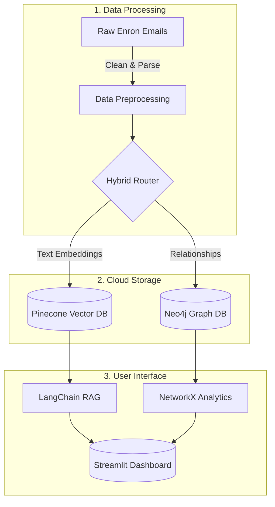

  # 🏢 AI KNOWLEDGE GRAPH BUILDER
  
  ### *Enterprise Intelligence Platform*
  
  [](https://python.org)
  [](https://streamlit.io)
  [](https://neo4j.com)
  [](https://pinecone.io)
  [](https://langchain.com)
  
  **Hybrid RAG · Real-time Graph Intelligence · SOC2-Ready**
  
  [📊 Live Demo](https://sabaridevk5-ai-enterprise-knowledge-graph-app-gu8t3s.streamlit.app/) • [🏃‍♂️ Agile Project Plan](Sabaridev%20K_%20Agile%20document.xlsx) • [🔐 Security](SECURITY.md)

</div>

---

## 📋 Overview

The AI Knowledge Graph Builder is a platform that turns thousands of corporate emails (the Enron dataset) into an interactive, searchable intelligence dashboard. 

Instead of just searching for keywords, this system combines **Semantic Search** (understanding the actual meaning of the text) with **Graph Networking** (mapping exactly who is talking to whom) to help investigators instantly find hidden risks and key influencers within a company.

---

## 🏗️ How It Works (Architecture)



---

## ✨ Key Features

* 🔍 **Hybrid Intelligence:** Get answers backed by both semantic meaning (Pinecone) and verified employee relationships (Neo4j).
* 🕸️ **Live Network Graph:** Explore an interactive map of communication that automatically rebuilds and centers on the people in your search results.
* 🛡️ **Zero-Trust Security:** Built with strict security standards. Absolutely no hardcoded passwords; all database keys are secured via cloud vaults.
* 🏃‍♂️ **Agile Development:** Developed in 4 iterative sprints. You can view the complete product backlog, daily stand-ups, and retrospectives in our [Agile Tracking Document](https://www.google.com/search?q=Sabaridev%2520K_%2520Agile%2520document.xlsx).

---

## 💻 Technology Stack

* **Frontend:** Streamlit, Plotly (for interactive visualizations)
* **AI & Orchestration:** LangChain, HuggingFace (`all-MiniLM-L6-v2` embedding model)
* **Databases:** Pinecone (Vector Store), Neo4j AuraDB (Graph Store)
* **Language:** Python 3.13

---

## 📁 Repository Structure

```text
ai-knowledge-graph-builder/
├── 📂 src/
│   ├── app.py                      # Main Streamlit dashboard
│   ├── milestone1_preprocessing.py # Data cleaning scripts
│   ├── milestone2_graph_build.py   # Neo4j connection logic
│   ├── milestone3_semantic_search.py
│   └── m4_upload_to_pinecone.py    # Vector database scripts
├── 📂 data/                        # Raw and cleaned CSV files
├── 📄 Sabaridev K_ Agile document.xlsx # ⬅️ Agile Project Management Tracker
├── 📄 requirements.txt             # Python dependencies
├── 📄 .env.example                 # Template for local API keys
├── 📄 SECURITY.md                  # Security and compliance guidelines
└── 📄 README.md                    # You are here

```

---

## 🚀 How to Run Locally

1. **Clone the repository:**
```bash
git clone [https://github.com/yourusername/ai-knowledge-graph-builder.git](https://github.com/yourusername/ai-knowledge-graph-builder.git)
cd ai-knowledge-graph-builder

```


2. **Install dependencies:**
```bash
pip install -r requirements.txt

```


3. **Configure Environment:** Rename `.env.example` to `.env` and paste in your Pinecone and Neo4j credentials.
4. **Launch the Dashboard:**
```bash
streamlit run src/app.py

```


---

<div align="center">

**Built for the Infosys Enterprise Intelligence Review**

© 2026 AI Knowledge Graph Builder | Sabaridev K

