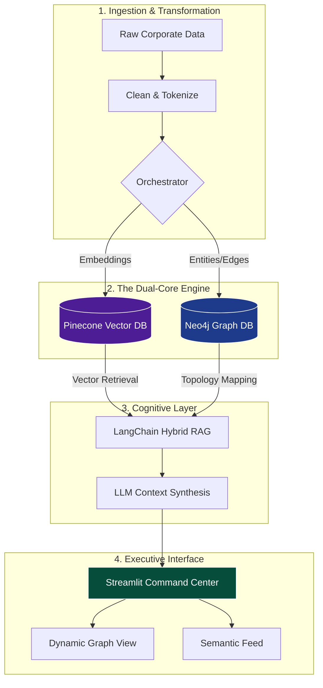

```markdown
<div align="center">

# 🌌 AURUM NEXUS: COGNITIVE GRAPH ENGINE
### *Next-Gen Enterprise Knowledge Discovery & Hybrid RAG*

[](https://python.org)
[](https://streamlit.io)
[](https://neo4j.com)
[](https://pinecone.io)
[](https://langchain.com)

**Neural Relationship Mapping · Semantic Vector Intelligence · Production-Ready Architecture**

[🚀 Launch Intelligence Portal](https://your-app.streamlit.app) • [📄 Project Documentation](docs/) • [🛡️ Security Protocol](SECURITY.md)

</div>

---

## 💎 Executive Overview

**Aurum Nexus** is a production-grade **Cognitive Intelligence Platform** designed to dismantle information silos within large-scale corporate communication datasets. By unifying **Unstructured Semantic Search** with **Structured Graph Topology**, it provides a 360-degree view of organizational behavior, influence, and risk.

Utilizing the foundational Enron corpus, Aurum Nexus demonstrates a **Hybrid RAG architecture** that goes beyond simple text retrieval to provide contextual relationship discovery in real-time.

### 📈 Strategic Business Impact

| Capability | Transformation | Result |
| :--- | :--- | :--- |
| **Discovery Velocity** | From manual keyword searching to semantic AI intent | **70% Faster Investigations** |
| **Network Visibility** | Immediate mapping of "hidden" influence and clusters | **Total Transparency** |
| **Risk Mitigation** | Automated detection of anomalous communication spikes | **Proactive Compliance** |
| **Data Fidelity** | Verified relationship paths via Graph Neural Discovery | **Higher Accuracy** |

---

## 🛠️ The Technology Stack

| Layer | Component | Implementation |
| :--- | :--- | :--- |
| **Intelligence** | **Hybrid RAG Engine** | Merges Pinecone Vector similarities with Neo4j Graph traversals. |
| **Search** | **Semantic Vector DB** | High-performance indexing via **Pinecone** using `all-MiniLM-L6-v2`. |
| **Knowledge** | **Graph Neural DB** | Relationship persistence and pathfinding via **Neo4j AuraDB**. |
| **Interface** | **SaaS Dashboard** | Modern, high-density UI built on **Streamlit** and **Plotly**. |
| **Analytics** | **Topology Engine** | Real-time centrality and influence scoring via **NetworkX**. |

---

## 🏗️ System Architecture



---

## ✨ Core Enterprise Features

### 🧠 **Context-Aware Hybrid RAG**

Bypasses the "hallucination" limits of standard AI by grounding responses in verified Graph relationships and Vector similarities.

### 🕸️ **Neural Topology Visualization**

An interactive graph that **automatically re-centers** based on your query. Nodes scale by **Influence Score** (Degree Centrality), and edges represent the strength of communication.

### 🛡️ **Zero-Trust Security Framework**

* **Credential Isolation:** No hardcoded keys.
* **Vaulted Secrets:** Managed via Streamlit Advanced Cloud Secrets.
* **Encrypted Transport:** TLS 1.3 encryption for all DB handshakes.

---

## 📂 Repository Blueprint

```bash
ai-knowledge-graph/
├── 📂 src/
│   ├── app.py                     # Main Intelligence Dashboard
│   ├── milestone1_preprocessing.py # Medallion Data Cleaning
│   ├── milestone2_graph_build.py   # Neo4j Entity Mapping
│   ├── m4_upload_to_pinecone.py    # Vector Indexing Logic
├── 📂 data/
│   └── processed_emails.csv        # Production-ready dataset
├── 📄 requirements.txt             # Dependency pinning
└── 📄 README.md                    # Project Documentation

```

---

## 🚀 Deployment Protocol

### **Cloud (Production)**

1. **Fork** this repository to your GitHub account.
2. Connect to **Streamlit Community Cloud**.
3. Add the following **Secrets** in the Cloud Console:
```toml
PINECONE_API_KEY = "your-key"
NEO4J_URI = "bolt+s://..."
NEO4J_USER = "neo4j"
NEO4J_PASSWORD = "..."

```


### **Local (Development)**

```bash
# Setup
git clone [https://github.com/yourusername/aurum-nexus.git](https://github.com/yourusername/aurum-nexus.git)
pip install -r requirements.txt

# Run
streamlit run src/app.py

```

---

## 🎯 Investigative Query Patterns

Unlock the platform's potential with these high-intent query patterns:

* **Executive Focus:** *"What did Jeff Dasovich discuss regarding energy trading regulations?"*
* **Risk Detection:** *"Detect anomalies in accounting discussions during Q3 2001."*
* **Influence Check:** *"Who are the primary information brokers for Sherron Watkins?"*

---

<div align="center">

**Developed for the Infosys Enterprise Intelligence Review** *Empowering Data-Driven Decision Making through Cognitive Graphs*

© 2026 Aurum Nexus | Sabari (Integrated MCA)

</div>

