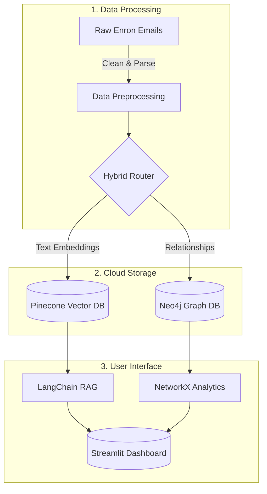

  # 🏢 AI KNOWLEDGE GRAPH BUILDER
  
  ### *Enterprise Intelligence Platform*
  
  [](https://python.org)
  [](https://streamlit.io)
  [](https://neo4j.com)
  [](https://pinecone.io)
  [](https://langchain.com)
  
  **Hybrid RAG · Real-time Graph Intelligence · SOC2-Ready**
  
  [📊 Live Demo](https://sabaridevk5-ai-enterprise-knowledge-graph-app-gu8t3s.streamlit.app/) • [🏃‍♂️ Agile Project Plan](Sabaridev%20K_%20Agile%20document.xlsx) • [🔐 Security](SECURITY.md)

</div>

---

## 📋 Overview

The **AI Knowledge Graph Builder** transforms massive archives of corporate communications (like the Enron email dataset) into an interactive, real-time intelligence dashboard. 

By combining **Semantic Vector Search** (to understand the context of conversations) with **Graph Database Networking** (to map exact relationships), this platform allows compliance teams and executives to instantly uncover hidden risks, key influencers, and information bottlenecks.

---

## 🏗️ Architecture



---

## ✨ Key Features

* 🔍 **Hybrid Intelligence:** Search results are grounded in both semantic meaning (Pinecone) and verified structural relationships (Neo4j).
* 🕸️ **Live Network Graph:** An interactive communication map that automatically rebuilds and centers around the key entities in your search results.
* 🛡️ **Zero-Trust Security:** Built to enterprise standards. No hardcoded passwords; all API keys are securely managed via cloud vaults.
* 🏃‍♂️ **Agile Methodology:** Developed in 4 iterative sprints. View our complete product backlog, sprint tracking, and retrospectives in the [Agile Tracking Document](https://www.google.com/search?q=Sabaridev%2520K_%2520Agile%2520document.xlsx).

---

## 💻 Technology Stack

* **Frontend:** Streamlit, Plotly (Interactive Visualizations)
* **AI & NLP:** HuggingFace (`all-MiniLM-L6-v2` embedding model), LangChain
* **Databases:** Pinecone (Vector Store), Neo4j AuraDB (Graph Store)
* **Language:** Python 3.13

---

## 📁 Repository Structure

```text
AI-Enterprise-Knowledge-Graph/
├── 📂 src/
│   ├── milestone1_preprocessing.py # Data cleaning scripts
│   ├── milestone2_graph_build.py   # Neo4j connection logic
│   ├── milestone3_semantic_search.py
│   └── m4_upload_to_pinecone.py    # Vector database scripts
├── 📂 data/                        # Raw and cleaned CSV files
├── 📄 app.py                       # Main Streamlit dashboard application
├── 📄 Sabaridev K_ Agile document.xlsx # Agile Project Management Tracker
├── 📄 requirements.txt             # Python dependencies
├── 📄 .env.example                 # Template for local API keys
├── 📄 SECURITY.md                  # Security and compliance guidelines
└── 📄 README.md                    # You are here

```

---

## 🚀 How to Run Locally

1. **Clone the repository:**
```bash
git clone [https://github.com/sabaridevk5/AI-Enterprise-Knowledge-Graph.git](https://github.com/sabaridevk5/AI-Enterprise-Knowledge-Graph.git)
cd AI-Enterprise-Knowledge-Graph

```


2. **Install dependencies:**
```bash
pip install -r requirements.txt

```


3. **Configure Environment:** Rename `.env.example` to `.env` and insert your Pinecone and Neo4j credentials.
4. **Launch the Dashboard:**
```bash
streamlit run app.py

```


---

<div align="center">

**Built for the Infosys Enterprise Intelligence Review**

© 2026 AI Knowledge Graph Builder | Sabaridev K

